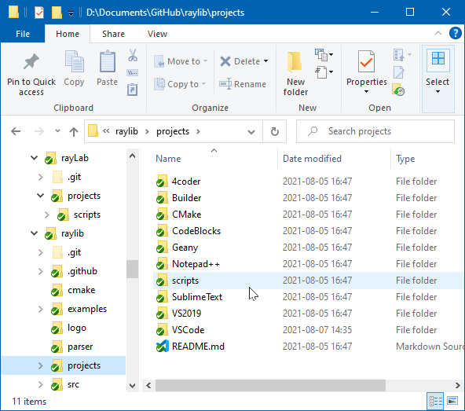

<!-- README.md 0.0.2               UTF-8                          2021-08-16
                     Native Windows raylib Laboratory
     -->

# rayLab

GitHub project orcmid/rayLab is a laboratory for experimental adaptation of
GitHub raysan5/raylib libraries for Native Windows desktop PC applications,
especially graphical games.

Freely-available tools are featured:

 * git and gitHub for backup and change management
 * Microsoft Visual Studio Build Tools for compiling, testing, and deploying
 * Microsoft Visual Studio Code for editing and integrated operation

rayLab shadows raysan5/raylib, mimicking the structure in situation of
experiments.  Copies and customizations of raylib materials are on
corresponding shadow locations.

The first step is to establish simple use of VS Build Tools in conducting
all of the builds and example exercises in the raylib repository.

More will follow.

## Shadowing raylib

[Shadowing with Adjacent Repos](rayLab-2021-08-16-2048-raylibShadowing.png)

<!-- 0.0.2 2021-08-17T04:13Z Add linking caption over centered image
     0.0.1 2021-08-17T04:02Z Add Example of Adjacent repository clones
     0.0.0 2021-08-16T23:29Z Simple introductory placeholder
     -->
