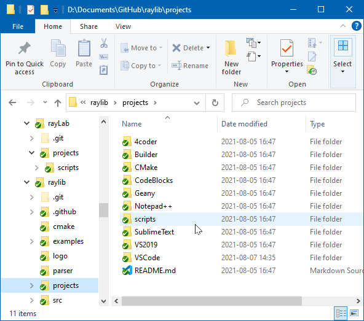
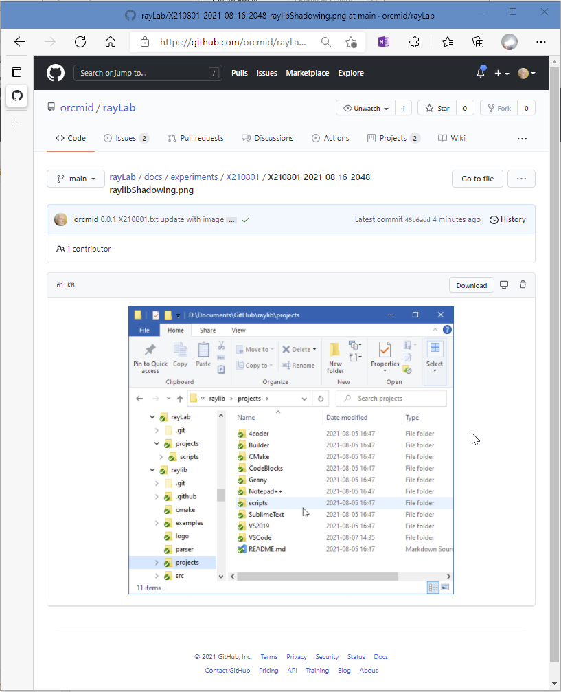

<!-- index.md 0.0.0                UTF-8                          2021-08-23
                X210801: SCREEN CAPTURE QUALITY DEGRADATION
     -->

# Experiment X210801: Screen Capture Quality Degradation

## Summary

The GitHub site presents down-sampled (degraded) versions of image files
when they are viewed in "`<> Code`".  The limitation extends to image files
incorporated in rendered Markdown files, such as `README.md` in "`<> Code`".

## Mitigation

Detailed images should not be incorporated in Markdown (`.md`) pages intended
to be viewed directly via navigation around github.com project repositories.

It is also generally good practice to keep images lossless (`.png` instead of
`.jpg`), viewed large, and cropped to the essential material.  Full-screen
captures are generally not advisable for presentation in complete detail.

## Avoidance

Embedded images in Markdown files rendered via GitHub Pages, including this
one, do not show degradation unless the viewed page is too small.  The full
details can be made visible by expanding the browser window or accessing the
full-sized image through a link.

## Demonstration

This image,

was originally intended for presentation in the orcmid/rayLab README file.
Viewing of that image is degraded when retrieved via
[GitHub <> Code view](https://github.com/orcmid/rayLab/blob/main/docs/experiments/X210801/X210801-2021-08-16-2048-raylibShadowing.png).
Contrast that view with the one obtained by directly accessing the same
image file directly from its
[orcmid.github.io web location](https://orcmid.github.io/rayLab/experiments/X210801/X210801-2021-08-16-2048-raylibShadowing.png), enlarging the browser window until full detail appears.

## Reproducibility

There may be Internet browser effects that also intrude on this situation.
For comparison, here is an image that shows the degradation observed by the
author.  It should be even more degraded when viewed from its
[GitHub <> Code location](https://github.com/orcmid/rayLab/blob/main/docs/experiments/X210801/X210801-2021-08-23-1244-TheDownSampling.png) in contrast with viewing directly
from the [orcmid.github.io X210801 location](X210801-2021-08-23-1244-TheDownSampling.png).

.

<!-- 0.0.1 2021-08-23T21:35Z Touch-ups following proof-reading.
     0.0.0 2021-08-23T21:24Z Draft description of the experimental findings.
     -->
