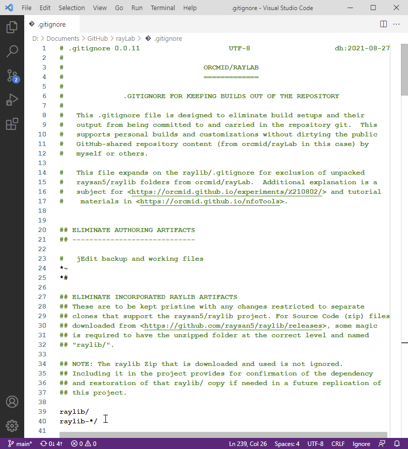
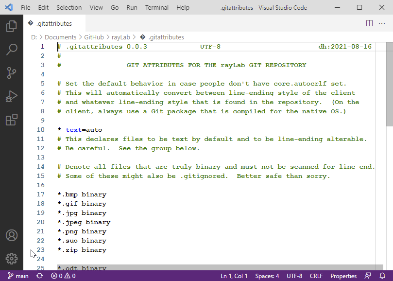

<!-- X210802a.md 0.0.3              UTF-8                          2021-08-31
     ----1----|----2----|----3----|----4----|----5----|----6----|----7----|--*

            ARRANGING GIT FOR RAYLIB INSIDE WINDOWS PROJECTS
     -->

# Arranging Git\[Hub\] for raylib Inside Windows Projects

When a raylib-using software project is managed with Git, possibly
as a GitHub project, some adjustments are necessary for the incorporation
of raylib code inside the project:

* [Assumptions about Git\[Hub\]](##assumptions-about-github)
* [Establishing `.gitignore`](#establishing-gitignore)
* [Distinguishing non-text formats with `.gitattributes`](#establishing-gitattributes)

In the recommended approach, the raylib release `.zip` file will be included
in the project, but the extracted raylib/ library is excluded from the
Windows project's source-code management.

## Assumptions about Git\[Hub\]

If your project is not under source-code management/backup using Git, it is
not necessary to conduct this part of the setup for raylib inside of a
project.

When Git is used, an actual `.git` repository is effectively kept out of sight
in some form.  When a project is backed up by Git, or cloned via Git,
what's seen directly are the working folders where the programming work is
done.  All of the project files (of a selected Git branch) are visible and
available for modifications and additions.  Git software utilities, such as
[Git for Windows](https://gitforwindows.org/),
[Tortoise Git](https://tortoisegit.org/), and
[GitHub Desktop](https://desktop.github.com/), provide
check-ins (commits) of new and changed files into the local Git repository.
Those utilities, and command-line versions, also provide for the
synchronization of a local Git repository with an external version in the
cloud (e.g., at GitHub).

The files `.gitignore` and `.gitattributes` are used to moderate how utilities
will make adjustments between the local Git repository and the local
working folders on a computer.

## Establishing .gitignore

If Git is being used and there is no `.gitignore` in a project, it is
recommended that one be added in the top-level folder of the project.

If there is a `.gitignore`, it should be modified, if necessary, to exclude
the `raylib/` library folder brought internal to the project folder.

The one employed for `orcmid/rayLab`, with annotation, has the important cases
near the top: exclusion of `raylib` and `raylib-*/` from Git source-code
management.

The current complete file is available at
[orcmid/rayLab/.gitignore](https://github.com/orcmid/rayLab/blob/main/.gitignore).
An alternative is to make the two additions, above, to a copy of
[raysan5/raylib/.gitignore](https://github.com/raysan5/raylib/blob/master/.gitignore), the file on which the rayLab one is based.

## Establishing .gitattributes

Git makes certain adjustments between how text files are contained inside the
Git repository and then how they are formatted in the working folder where
Git-managed files are carried.  These adjustments matter between
platforms where the handling of line-ends in text may differ from the
Git-internal default.

If Git treatment of line-end adjustments is performed on a non-text (i.e., binary) file, that file will be damaged in a clone and/or in the repository itself.  The addition of a `gitattributes` file will protect against such
inappropriate modifications.

Here the specification of common image formats and also `.zip` matters.  The
use of `text=auto` is to avoid unexpected treatment of line-endings on
whatever platform the project Git is used.  Treating all text as binary
is simpler; there can be alternative surprises.

The current complete file is available at
[orcmid/rayLab/.gitattributes](https://github.com/orcmid/rayLab/blob/main/.gitattributes).

<!-- ----1----|----2----|----3----|----4----|----5----|----6----|----7----|--*

     0.0.3 2021-08-31T20:13Z link the prologue to section-title anchors
     0.0.2 2021-08-30T20:06Z add rulers
     0.0.1 2021-08-27T21:22Z Use correct unordered list syntax
     0.0.0 2021-08-27T21:16Z First draft on .gitignore and .gitattributes.

                        *** end of X210802a.md ***
     -->
