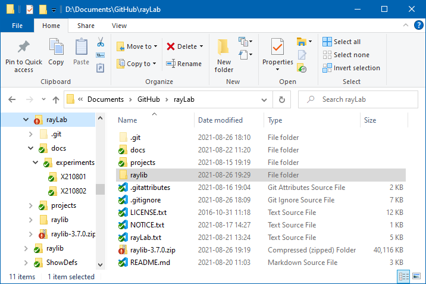

<!-- index.md 0.0.3                UTF-8                          2021-08-30
     ----1----|----2----|----3----|----4----|----5----|----6----|----7----|--*

               X210802: INSTALLING RAYLIB INSIDE WINDOWS PROJECTS
     -->

# Experiment X210802: Installing raylib Inside Windows Projects

## Synopsis

It's useful to include the raylib code ***inside*** of a project that relies
on raylib graphical functions.  The raylib code is not manipulated inside the
project.  Raylib code is carried within the project for easy location
and for stability.  The code is then directly compiled along with
the containing project's code to make a complete program.  It is all
self-contained.

The inside-project setup of raylib is used in the `orcmid/rayLab` project.
That setup is used for illustration.

## The Objective

When a raylib release is installed in a project, the view in Windows File
Explorer will resemble this one of the GitHub `orcmid/rayLab` project as
cloned on a Windows 10 PC.

The important features are

* This is the top level of the `rayLab/` project files.
* There is a `raylib` folder at that level.  The absence of any circular tag
on the tiny folder icon confirms that code is not under the RayLab project's
Git management.
* Folder `raylib` content is from the `raylib-3.7.0.zip` included in the
project.

This is achieved in three steps.

1. [Arranging Git\[Hub\] for raylib Inside Windows Projects](X210802a).  For a Git-supported project such as rayLab, `.gitattributes` and
`.gitignore` files are used to treat the `raylib` folder and the
`raylib-3.7.0.zip` file properly once they are introduced.  This step is
required only when Git is used.  If a project is later placed under Git, this
step should be revisited.

2. The source code `.zip` for a raylib release is downloaded.

3. The `raylib` folder is created from the `.zip` content.

Further developments, including confirmation of the setup, are accomplished
in additional steps.  Additional lab notes will account for that.

<!-- ----1----|----2----|----3----|----4----|----5----|----6----|----7----|--*

     0.0.3 2021-08-30T20:04Z add rulers
     0.0.2 2021-08-28T20:32Z Touch-ups and some wordsmithing
     0.0.1 2021-08-28T04:28Z Sketch the procedure and its objective.
     0.0.0 2021-08-27T18:45Z Draft placeholder of the confirmed setup.
     -->
